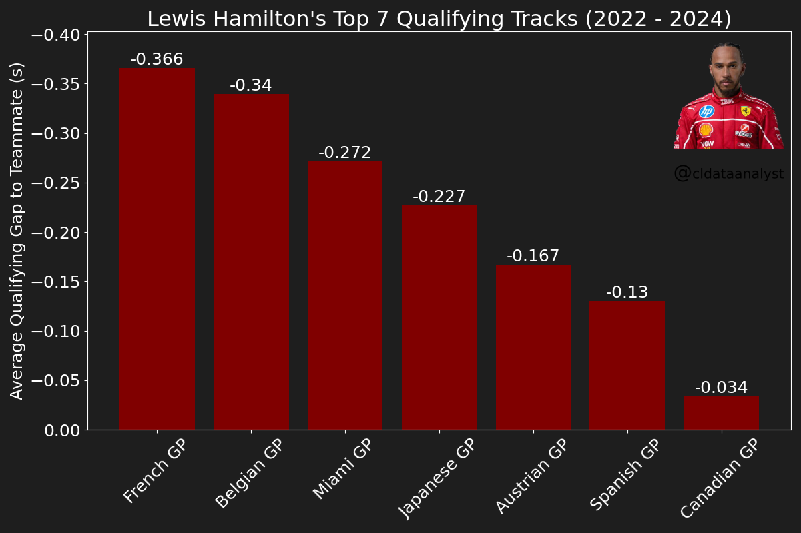
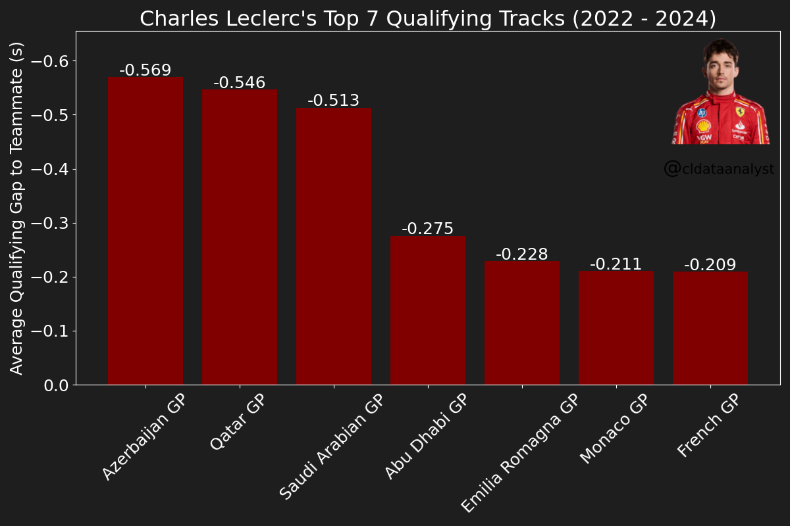

# 🏎️ F1 Driver Top Qualifying Tracks Analyzer

A Python tool that analyzes an F1 driver's qualifying performance across multiple seasons by comparing their fastest laps to their teammate's, highlighting which tracks the driver excels at most based on average qualifying gap.

---

## 📊 What It Does

The script uses [FastF1](https://docs.fastf1.dev/) to load qualifying session data across a range of years and:

- Calculates qualifying gaps between a driver and their teammate for each race
- Filters out outliers to keep results accurate
- Computes average gap per track across chosen years
- Identifies the driver's strongest qualifying tracks (largest negative gaps to teammate)
- Generates a clear bar graph highlighting their top qualifying circuits
- Customizable for any driver, year range, and number of top tracks

---

## 🖼️ Example Output

> **Ferrari Drivers' Top 7 Qualifying Tracks — Ground Effect Era (2022–2024)**
>
> As we continue into the season, let's see what each Ferrari driver's top 7 qualifying tracks have been in the ground effect era. To do so, we compare drivers' quickest qualifying laps to their teammates' quickest qualifying laps — a good way to see which tracks drivers like qualifying on.
>
> For **Leclerc**, it's no surprise that the Azerbaijan GP has been his strongest qualifying track, although he has remained unable to win there despite taking poles in 2022–2024.
>
> For **Hamilton**, the French GP is noted as his best qualifying track, however it should be noted that the French GP was discontinued after 2022. His second-best, the Belgian GP, should be considered his true top qualifying track.
>
> *\*\* Outliers are removed in this analysis. Any qualifying gap larger than ±2 seconds was excluded from the data.*

<p align="center">
  
  <br/><em>Charles Leclerc — Top 7 Qualifying Tracks (2022–2024)</em>
</p>

<p align="center">
  
  <br/><em>Lewis Hamilton — Top 7 Qualifying Tracks (2022–2024)</em>
</p>

> **Note:** The images above have been post-edited for the original Instagram post — the script generates the bar chart only. Additional text, context, and visual elements were added manually afterward.

---

## ⚙️ Setup

### Prerequisites

```bash
pip install fastf1 matplotlib
```

### FastF1 Cache

The script uses a local cache to avoid re-downloading session data. Make sure the cache directory exists:

```bash
mkdir fastf1_cache
```

---

## 🚀 Usage

Modify the variables at the top of the script and run it:

```python
yearstart = 2022       # Start of year range
yearend = 2024         # End of year range

target_driver = 'Charles Leclerc'  # Full driver name

topqualirange = 7      # Number of top qualifying tracks to display
outlierlimit = 2       # Max gap in seconds before a result is excluded as an outlier

bar_color = "maroon"   # Bar color for the chart
chartsize = (20, 6)
fontsize = 20
```

Then run:

```bash
python qualifying_analyzer.py
```

---

## 📁 Project Structure

```
├── qualifying_analyzer.py  # Main script
└── fastf1_cache/           # Auto-populated cache directory
```

---

## 🔧 Customization

| Variable | Description |
|----------|-------------|
| `yearstart` / `yearend` | Season range to analyze |
| `target_driver` | Full driver name as recognized by FastF1 |
| `topqualirange` | How many top tracks to display |
| `outlierlimit` | Outlier threshold in seconds (gaps beyond ±this value are excluded) |
| `bar_color` | Color of the bars in the chart |
| `chart_title` | Auto-generated but can be overridden |
| `chartsize` | Width × height of the output figure |
| `fontsize` | Font size for all chart text |

---

## 📦 Dependencies

- [FastF1](https://github.com/theOehrly/Fast-F1) — F1 telemetry and timing data
- [Matplotlib](https://matplotlib.org/) — Bar chart rendering and visualization

---

*Built by [Jazib Ahmed](https://github.com/jazib-17)*
